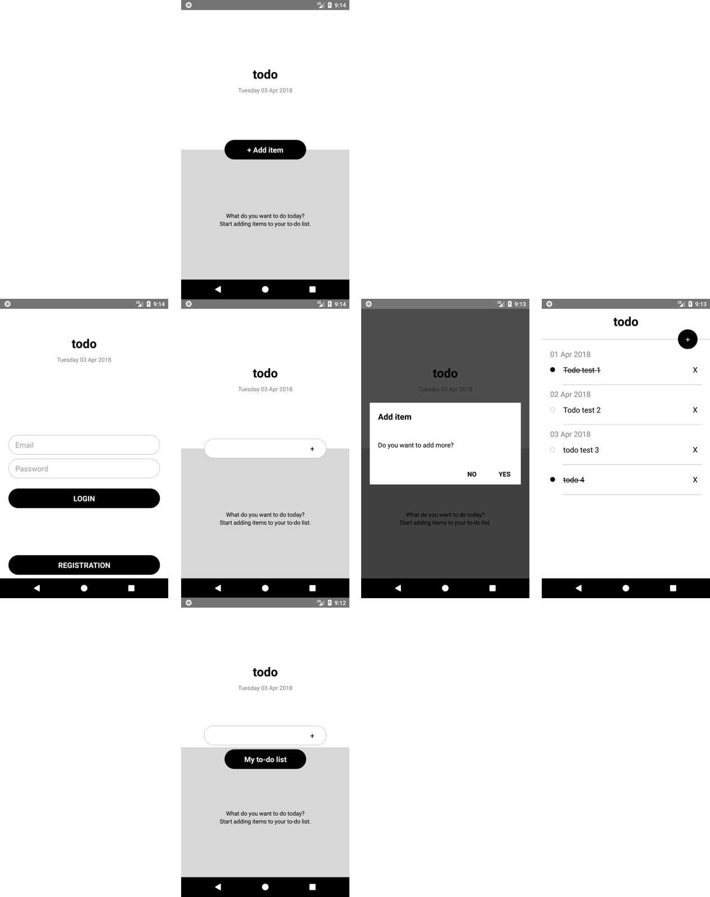

# todo-ReactNative
todo app using React Native and Redux with ES6 standards

## Requirements
- React Native app development environment

## Installation
1. Clone this repository
2. Install the application: `npm install`
3. To run the app use `react-native run-android` for Android `react-native run-ios` for iOS
3. You can use `npm run test` for tests output

Note: 
- To run on Android update `local.properties` for sdk `sdk.dir=/Users/<user name>/Library/Android/sdk`

#### APK
Download android signed APK from `release` folder and install to use.

#### to-do app flow:

#### tests output:

